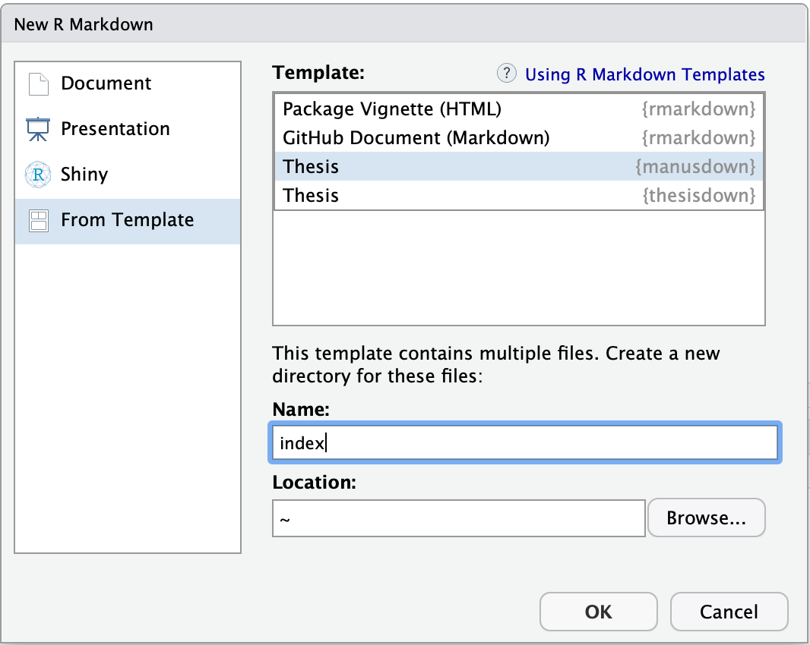

# manusdown

This project was based off of [thesisdown](https://github.com/ismayc/thesisdown). The template is based on the [MIT LaTeX template](http://web.mit.edu/thesis/tex/) and the Reed College LaTeX template. As noted on the MIT Thesis page, you should always consult the [MIT Libraries Thesis Specifications](http://libraries.mit.edu/archives/thesis-specs/) before submitting your thesis. Because I used this for writing my own thesis, while this template adheres to the MIT Thesis template, it is rather hacked together quickly, and there is much room for improvement. If you have suggestions/would like to push your changes, please get in touch! My email (for the time being) is yangjy [ at ] mit

Currently, the PDF and gitbook versions are fully-functional.  The word and epub versions are developmental, have no templates behind them, and are essentially calls to the appropriate functions in bookdown.

If you are new to working with `bookdown`/`rmarkdown`, please read over the documentation available in the `gitbook` template at https://thesisdown.netlify.com/.  This is also available below at https://ismayc.github.io/thesisdown_book.

As an example, a copy of my thesis is currently available [here](https://github.com/ratatstats/thesis/blob/master/_book/thesis.pdf).

The current output for three of the four versions is here:
- [PDF](https://github.com/ratatstats/manusdown_book/blob/master/thesis.pdf)
- [Word](https://github.com/ratatstats/manusdown_book/blob/master/thesis.docx)
- [ePub](https://github.com/ratatstats/manusdown_book/blob/master/thesis.epub)

Under the hood, the Reed College LaTeX template is used to ensure that documents conform precisely to submission standards. At the same time, composition and formatting can be done using lightweight [markdown](https://rmarkdown.rstudio.com/authoring_basics.html) syntax, and **R** code and its output can be seamlessly included using [rmarkdown](https://rmarkdown.rstudio.com).

## Customizing thesisdown to your institution

Please see Chester Ismay's thesisdown repo (https://github.com/ismayc/thesisdown) for more information.

### Using manusdown

Using **manusdown** has some prerequisites which are described below. To compile PDF documents using **R**, you are going to need to have LaTeX installed.  It can be downloaded for Windows at <https://miktex.org/download> and for Mac at <https://tug.org/mactex/mactex-download.html>.  Follow the instructions to install the necessary packages after downloading the (somewhat large) installer files.  You may need to install a few extra LaTeX packages on your first attempt to knit as well.

To use **manusdown** from RStudio:

1) Install the latest [RStudio](https://www.rstudio.com/products/rstudio/download/).
Only the version as of Oct 2017 has a recent enough Pandoc included so you may need to upgrade this
separately or install a newer RStudio.

    ```r
    rmarkdown::pandoc_available("1.2")
    #> [1] TRUE
    ```

2) Install the **bookdown** and **manusdown** packages: 

```r
install.packages("remotes")
remotes::install_github("rstudio/bookdown")
remotes::install_github("ratatstats/manusdown")
```

3) Use the **New R Markdown** dialog to select **Thesis**:

    

    Note that this will currently only **Knit** if you name the directory `index` as shown above.

4) After choosing which type of output you'd like in the YAML at the top of index.Rmd, **Knit** the `index.Rmd` file to get the book in PDF or HTML formats.
5) Edit the individual chapter R Markdown files as you wish and then re-run step (4) again.
